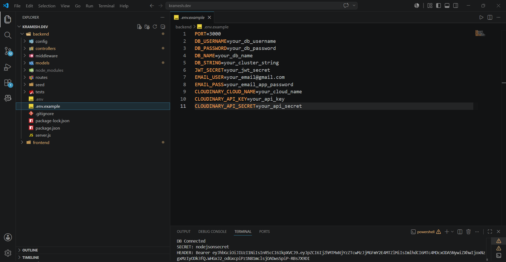
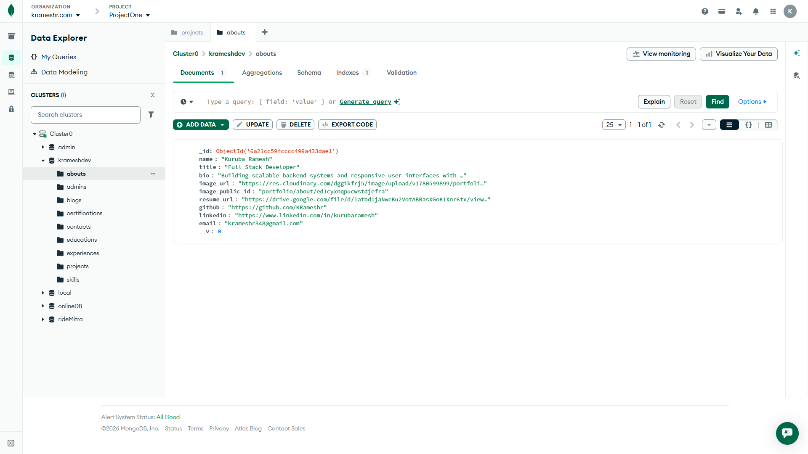

# kramesh.dev — Backend API

REST API for Kuruba Ramesh's personal portfolio — built with Node.js, Express.js and MongoDB.

## 🔗 Live API
```
https://kramesh-portfolio-backend.onrender.com
```

## 🛠️ Tech Stack

- **Runtime:** Node.js
- **Framework:** Express.js
- **Database:** MongoDB Atlas (Mongoose)
- **Authentication:** JWT (JSON Web Token)
- **Image Storage:** Cloudinary
- **Email:** Nodemailer (Gmail)
- **Security:** Helmet, CORS, express-rate-limit
- **Deployment:** Render

## 📁 Folder Structure

```
backend/
├── config/
│   ├── db.js              # MongoDB connection
│   └── cloudinary.js      # Cloudinary setup
├── controllers/
│   ├── authController.js
│   ├── aboutController.js
│   ├── projectsController.js
│   ├── skillsController.js
│   ├── blogsController.js
│   ├── certificationController.js
│   ├── educationController.js
│   ├── experienceController.js
│   └── contactController.js
├── middleware/
│   ├── auth.js            # JWT protect middleware
│   └── upload.js          # Multer memory storage
├── models/
│   ├── About.js
│   ├── Project.js
│   ├── Skill.js
│   ├── Blog.js
│   ├── Certification.js
│   ├── Education.js
│   ├── Experience.js
│   └── Contact.js
├── routes/
│   ├── auth.js
│   ├── about.js
│   ├── projects.js
│   ├── skills.js
│   ├── blogs.js
│   ├── certifications.js
│   ├── education.js
│   ├── experience.js
│   └── contact.js
├── .env.example
├── .gitignore
├── package.json
└── server.js
```
## 📊 System Architecture

### Backend Flow Diagram


### Database Schema Map


## 🚀 Getting Started

### 1. Clone the repo
```bash
git clone https://github.com/KRameshr/kramesh-portfolio-backend.git
cd kramesh-portfolio-backend
```

### 2. Install dependencies
```bash
npm install
```

### 3. Create `.env` file
```env
PORT=3000
DB_USERNAME=your_mongodb_username
DB_PASSWORD=your_mongodb_password
DB_NAME=krameshdev
DB_STRING=your_cluster_string
JWT_SECRET=your_jwt_secret
EMAIL_USER=your@gmail.com
EMAIL_PASS=your_gmail_app_password
CLOUDINARY_CLOUD_NAME=your_cloud_name
CLOUDINARY_API_KEY=your_api_key
CLOUDINARY_API_SECRET=your_api_secret
```

### 4. Run development server
```bash
npm run dev
```

Server runs on `http://localhost:3000`

## 📡 API Endpoints

### Public Routes
| Method | Endpoint | Description |
|--------|----------|-------------|
| GET | `/api/about` | Get about info |
| GET | `/api/projects` | Get all projects |
| GET | `/api/skills` | Get all skills |
| GET | `/api/blogs` | Get published blogs |
| GET | `/api/blogs/:slug` | Get blog by slug |
| GET | `/api/certifications` | Get certifications |
| GET | `/api/education` | Get education |
| GET | `/api/experience` | Get experience |
| POST | `/api/contact` | Send contact message |

### Admin Routes (JWT Required)
| Method | Endpoint | Description |
|--------|----------|-------------|
| POST | `/api/auth/login` | Admin login |
| PUT | `/api/about` | Update about |
| POST | `/api/projects` | Create project |
| PUT | `/api/projects/:id` | Update project |
| DELETE | `/api/projects/:id` | Delete project |
| POST | `/api/skills` | Create skill |
| PUT | `/api/skills/:id` | Update skill |
| DELETE | `/api/skills/:id` | Delete skill |
| GET | `/api/blogs/all` | Get all blogs (inc drafts) |
| POST | `/api/blogs` | Create blog |
| PUT | `/api/blogs/:id` | Update blog |
| DELETE | `/api/blogs/:id` | Delete blog |
| POST | `/api/certifications` | Add certification |
| PUT | `/api/certifications/:id` | Update certification |
| DELETE | `/api/certifications/:id` | Delete certification |
| POST | `/api/education` | Add education |
| PUT | `/api/education/:id` | Update education |
| DELETE | `/api/education/:id` | Delete education |
| POST | `/api/experience` | Add experience |
| PUT | `/api/experience/:id` | Update experience |
| DELETE | `/api/experience/:id` | Delete experience |
| GET | `/api/contact/messages` | Get all messages |
| DELETE | `/api/contact/messages/:id` | Delete message |

## 🔐 Authentication

Admin login returns a JWT token valid for 7 days.

```bash
POST /api/auth/login
Content-Type: application/json

{
  "email": "admin@email.com",
  "password": "yourpassword"
}
```

Use token in header for protected routes:
```
Authorization: Bearer <token>
```

## 📦 Scripts

```bash
npm start      # Production
npm run dev    # Development with nodemon
npm test       # Run tests
```

## 🌐 Deployment

Deployed on **Render** (free tier)
- Auto-deploy on GitHub push
- Environment variables set in Render dashboard
- Cron job on cron-job.org pings `/health` every 14 mins to prevent sleep

##  frontend
https://github.com/KRameshr/kramesh-portfolio-frontend

## 👨‍💻 Author

**Kuruba Ramesh** — Full Stack Developer
- Portfolio: [krameshdev.vercel.app](https://krameshdev.vercel.app)
- GitHub: [github.com/KRameshr](https://github.com/KRameshr)
- LinkedIn: [linkedin.com/in/kurubaramesh](https://linkedin.com/in/kurubaramesh)
