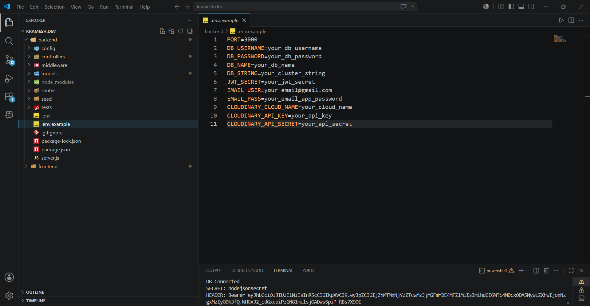
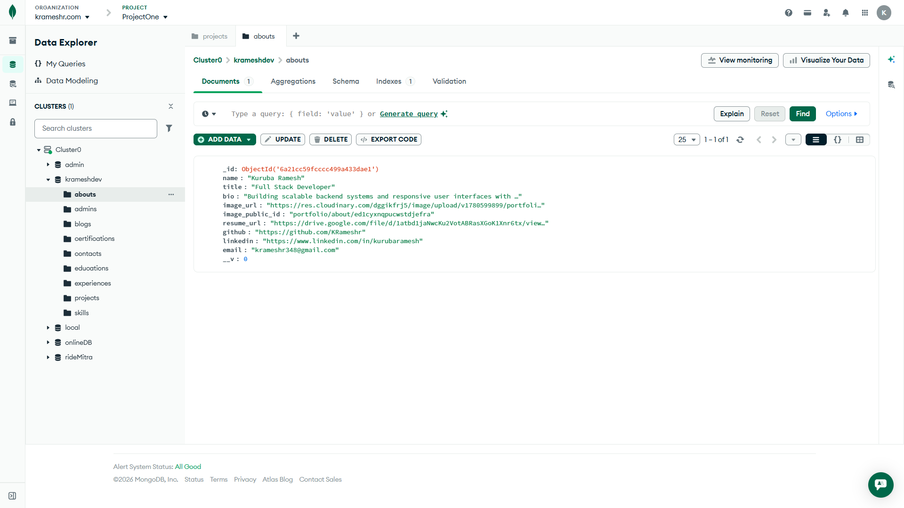

# kramesh.dev — Backend API

REST API for Kuruba Ramesh's personal portfolio — built with Node.js, Express.js and MongoDB, with an OpenAPI-first contract enforced through [Specmatic](https://specmatic.io/).

## 🔗 Live API

<<<<<<< HEAD
[https://kramesh-portfolio-backend.onrender.com](https://kramesh-portfolio-backend.onrender.com)

---
=======
```
https://kramesh-portfolio-backend.onrender.com
```
>>>>>>> add-specmatic-contract-testing

## 🛠️ Tech Stack

- **Runtime:** Node.js
- **Framework:** Express.js
- **Database:** MongoDB Atlas (Mongoose)
- **Authentication:** JWT (JSON Web Token)
- **Image Storage:** Cloudinary
- **Email:** Nodemailer (Gmail)
- **Security:** Helmet, CORS, express-rate-limit
<<<<<<< HEAD
- **Contract Testing:** Specmatic 3.0 (Open Source Config V3)
=======
- **Contract Testing:** Specmatic (OpenAPI 3.0, schema resiliency)
- **Testing:** Jest, Supertest
>>>>>>> add-specmatic-contract-testing
- **Deployment:** Render

---

## 📁 Folder Structure

<<<<<<< HEAD
```text
backend/
=======
```
kramesh-portfolio-backend/
>>>>>>> add-specmatic-contract-testing
├── config/
│   ├── db.js                        # MongoDB connection + strict Mongoose casting
│   └── cloudinary.js                # Cloudinary setup
├── controllers/
│   ├── authController.js
│   ├── aboutController.js
│   ├── projectsController.js
│   ├── skillsController.js
│   ├── blogsController.js
│   ├── certificationController.js
│   ├── educationController.js
│   ├── experienceController.js
│   └── contactController.js
├── middleware/
<<<<<<< HEAD
│   ├── auth.js            # JWT protect middleware
│   ├── upload.js          # Multer memory storage
│   └── simulateError.js   # Test-only middleware for 500 error paths
=======
│   ├── auth.js                      # JWT protect middleware
│   └── upload.js                    # Multer memory storage
>>>>>>> add-specmatic-contract-testing
├── models/
│   ├── About.js
│   ├── Project.js
│   ├── Skill.js
│   ├── Blog.js
│   ├── Certification.js
│   ├── Education.js
│   ├── Experience.js
│   └── Contact.js
├── routes/
│   ├── auth.js
│   ├── about.js
│   ├── projects.js
│   ├── skills.js
│   ├── blogs.js
│   ├── certifications.js
│   ├── education.js
│   ├── experience.js
│   └── contact.js
<<<<<<< HEAD
├── examples/              # Externalized JSON examples for Specmatic validation
├── openapi.yaml           # OpenAPI 3.0 Contract Specification
├── specmatic.yaml         # Specmatic Config V3 file
=======
├── utils/
│   ├── handleError.js               # Central error → HTTP status mapper
│   └── actuatorMappings.js          # Route inventory for Specmatic API coverage
├── seed/
│   ├── admin.js                     # Seeds the admin user
│   ├── specmaticTestData.js         # Seeds fixed-ID records for contract tests
│   └── generateTestToken.js         # Generates a valid JWT for contract tests
├── tests/
│   ├── auth.test.js
│   ├── projects.test.js
│   ├── contract.test.js             # Surfaces Specmatic results inside Jest
│   └── specmaticGlobalSetup.js      # Runs Specmatic before the Jest suite
├── openapi_examples/                # Named request/response examples for Specmatic
│   ├── create_education_success.json
│   ├── update_education_success.json
│   ├── delete_education_success.json
│   ├── create_experience_success.json
│   ├── update_experience_success.json
│   ├── delete_experience_success.json
│   ├── create_skill_success.json
│   ├── update_skill_success.json
│   └── delete_skill_success.json
>>>>>>> add-specmatic-contract-testing
├── .env.example
├── .gitignore
├── jest.config.json
├── openapi.yaml                     # OpenAPI 3.0 contract for the API
├── specmatic.yaml                   # Specmatic config v3 (schema resiliency, actuator)
├── package.json
└── server.js
```
<<<<<<< HEAD

---

## 📊 System Architecture

### Backend Flow Diagram


### Database Schema Map

=======
>>>>>>> add-specmatic-contract-testing

---

## 🚀 Getting Started

<<<<<<< HEAD
### 1. Prerequisites
- **Node.js**: v18 or higher
- **MongoDB**: Local instance or MongoDB Atlas
- **Java JRE**: 17+ (*Required for running Specmatic CLI*)

### 2. Clone the repo
=======
### 1. Clone the repo

>>>>>>> add-specmatic-contract-testing
```bash
git clone https://github.com/KRameshr/kramesh-portfolio-backend.git
cd kramesh-portfolio-backend
```

<<<<<<< HEAD
### 3. Install dependencies
=======
### 2. Install dependencies

>>>>>>> add-specmatic-contract-testing
```bash
npm install
```

<<<<<<< HEAD
### 4. Create `.env` file
=======
### 3. Create `.env` file

>>>>>>> add-specmatic-contract-testing
```env
PORT=3000
DB_USERNAME=your_mongodb_username
DB_PASSWORD=your_mongodb_password
DB_NAME=krameshdev
DB_STRING=your_cluster_string
JWT_SECRET=your_jwt_secret
NODE_ENV=test
EMAIL_USER=your@gmail.com
EMAIL_PASS=your_gmail_app_password
CLOUDINARY_CLOUD_NAME=your_cloud_name
CLOUDINARY_API_KEY=your_api_key
CLOUDINARY_API_SECRET=your_api_secret
```

<<<<<<< HEAD
### 5. Run development server
=======
### 4. Run development server

>>>>>>> add-specmatic-contract-testing
```bash
npm run dev
```

Server runs on `http://localhost:3000`

---

## 🧪 Contract Testing with Specmatic

This project leverages the latest **Specmatic Open Source Version** with **Specmatic Config V3 (`specmatic.yaml`)** to run API contract tests against all endpoints in `openapi.yaml`.

### 1. Configuration (`specmatic.yaml`)
```yaml
version: 3
contracts:
  - openapi.yaml
```

### 2. Validate External Examples
All test data is controlled via JSON examples in the `examples/` directory. Validate them against the spec before testing:
```bash
npx specmatic examples validate
```

### 3. Run Contract Tests
1. Start the server in test mode:
   ```bash
   NODE_ENV=test npm start
   ```
2. Execute Specmatic Contract Tests:
   ```bash
   npx specmatic test
   ```

---

## 📊 Test Coverage & Results

We have achieved **100% API coverage** across all 9 resources in the backend:

- **Total Specmatic Contract Tests:** 341 Passed
- **Total Jest Unit/Integration Tests:** 345 Passed
- **Coverage:** 100% Verified

| Resource Path | Specmatic Contract Test Status | Coverage |
| :--- | :--- | :--- |
| `/api/about` | ✅ Passed | 100% |
| `/api/auth` | ✅ Passed | 100% |
| `/api/blogs` | ✅ Passed | 100% |
| `/api/certifications` | ✅ Passed | 100% |
| `/api/contact` | ✅ Passed | 100% |
| `/api/education` | ✅ Passed | 100% |
| `/api/experience` | ✅ Passed | 100% |
| `/api/projects` | ✅ Passed | 100% |
| `/api/skills` | ✅ Passed | 100% |

---

## 📡 API Endpoints

### Public Routes
<<<<<<< HEAD
| Method | Endpoint | Description |
|---|---|---|
| GET | `/api/about` | Get about info |
| GET | `/api/projects` | Get all projects |
| GET | `/api/skills` | Get all skills |
| GET | `/api/blogs` | Get published blogs |
| GET | `/api/blogs/:slug` | Get blog by slug |
| GET | `/api/certifications` | Get certifications |
| GET | `/api/education` | Get education |
| GET | `/api/experience` | Get experience |
| POST | `/api/contact` | Send contact message |

### Admin Routes (JWT Required)
| Method | Endpoint | Description |
|---|---|---|
| POST | `/api/auth/login` | Admin login |
| PUT | `/api/about` | Update about |
| POST | `/api/projects` | Create project |
| PUT | `/api/projects/:id` | Update project |
| DELETE | `/api/projects/:id` | Delete project |
| POST | `/api/skills` | Create skill |
| PUT | `/api/skills/:id` | Update skill |
| DELETE | `/api/skills/:id` | Delete skill |
| GET | `/api/blogs/all` | Get all blogs (inc drafts) |
| POST | `/api/blogs` | Create blog |
| PUT | `/api/blogs/:id` | Update blog |
| DELETE | `/api/blogs/:id` | Delete blog |
| POST | `/api/certifications` | Add certification |
| PUT | `/api/certifications/:id` | Update certification |
| DELETE | `/api/certifications/:id` | Delete certification |
| POST | `/api/education` | Add education |
| PUT | `/api/education/:id` | Update education |
| DELETE | `/api/education/:id` | Delete education |
| POST | `/api/experience` | Add experience |
| PUT | `/api/experience/:id` | Update experience |
| DELETE | `/api/experience/:id` | Delete experience |
| GET | `/api/contact/messages` | Get all messages |
| DELETE | `/api/contact/messages/:id` | Delete message |
=======

| Method | Endpoint              | Description          |
| ------ | --------------------- | -------------------- |
| GET    | `/api/about`          | Get about info       |
| GET    | `/api/projects`       | Get all projects     |
| GET    | `/api/skills`         | Get all skills       |
| GET    | `/api/blogs`          | Get published blogs  |
| GET    | `/api/blogs/:slug`    | Get blog by slug     |
| GET    | `/api/certifications` | Get certifications   |
| GET    | `/api/education`      | Get education        |
| GET    | `/api/experience`     | Get experience       |
| POST   | `/api/contact`        | Send contact message |

### Admin Routes (JWT Required)

| Method | Endpoint                    | Description                 |
| ------ | --------------------------- | --------------------------- |
| POST   | `/api/auth/login`           | Admin login                 |
| PUT    | `/api/about`                | Update about                |
| POST   | `/api/projects`             | Create project              |
| PUT    | `/api/projects/:id`         | Update project              |
| DELETE | `/api/projects/:id`         | Delete project              |
| POST   | `/api/skills`               | Create skill                |
| PUT    | `/api/skills/:id`           | Update skill                |
| DELETE | `/api/skills/:id`           | Delete skill                |
| GET    | `/api/blogs/all`            | Get all blogs (inc. drafts) |
| POST   | `/api/blogs`                | Create blog                 |
| PUT    | `/api/blogs/:id`            | Update blog                 |
| DELETE | `/api/blogs/:id`            | Delete blog                 |
| POST   | `/api/certifications`       | Add certification           |
| PUT    | `/api/certifications/:id`   | Update certification        |
| DELETE | `/api/certifications/:id`   | Delete certification        |
| POST   | `/api/education`            | Add education               |
| PUT    | `/api/education/:id`        | Update education            |
| DELETE | `/api/education/:id`        | Delete education            |
| POST   | `/api/experience`           | Add experience              |
| PUT    | `/api/experience/:id`       | Update experience           |
| DELETE | `/api/experience/:id`       | Delete experience           |
| GET    | `/api/contact/messages`     | Get all messages            |
| DELETE | `/api/contact/messages/:id` | Delete message              |
>>>>>>> add-specmatic-contract-testing

---

## 🔐 Authentication

Admin login returns a JWT token valid for 7 days.

```http
POST /api/auth/login
Content-Type: application/json

{
  "email": "admin@email.com",
  "password": "yourpassword"
}
```

<<<<<<< HEAD
Use token in header for protected routes:
```http
=======
Use the token in the header for protected routes:

```
>>>>>>> add-specmatic-contract-testing
Authorization: Bearer <token>
```

---

## ⚙️ CI/CD Pipeline

Specmatic contract tests are integrated into **GitHub Actions** (`.github/workflows/ci.yml`). On every Push or Pull Request:
1. Provisions Node.js, Java JRE 17, and MongoDB service containers.
2. Runs `npx specmatic examples validate` to check example validities.
3. Spawns the server and runs `npx specmatic test`.
4. Uploads auto-generated Specmatic HTML Coverage reports as GitHub Actions artifacts.

---

## 🎭 Frontend Mock Server Setup

Specmatic can be used as a stub server during frontend development:
```bash
npx specmatic stub
```

---

## 📦 Scripts

```bash
npm start      # Production
npm run dev    # Development with nodemon
npm test       # Run Jest unit tests + Specmatic contract tests
```

---

## 🌐 Deployment

Deployed on **Render** (free tier)

<<<<<<< HEAD
---

## 🔗 Frontend Repository
[https://github.com/KRameshr/kramesh-portfolio-frontend](https://github.com/KRameshr/kramesh-portfolio-frontend)

---
=======
- Auto-deploy on GitHub push
- Environment variables set in the Render dashboard
- A cron job on cron-job.org pings `/health` every 14 minutes to prevent sleep

## 🖥️ Frontend

https://github.com/KRameshr/kramesh-portfolio-frontend
>>>>>>> add-specmatic-contract-testing

---

## Contract Testing with Specmatic

The `education`, `experience`, and `skills` resources are governed by an [OpenAPI 3.0](openapi.yaml) contract and verified with [Specmatic](https://specmatic.io/) (open source, v2.51.1) — including generative **schema resiliency tests** that mutate field types, omit required fields, and send empty bodies to confirm the API rejects bad input with the correct 4xx status instead of silently accepting it or returning a 500.

### What's configured

- **[`specmatic.yaml`](specmatic.yaml)** — Config v3, `schemaResiliencyTests: all`, and an `actuatorUrl` pointed at a custom `/actuator/mappings` endpoint (Node's equivalent of Spring Boot Actuator) so Specmatic can report accurate API coverage against the routes actually registered in Express.
- **[`openapi_examples/`](openapi_examples/)** — Named external examples (create/update/delete, per resource) used as realistic seeds for schema resiliency mutations, instead of inline examples in the spec.
- **Fixed-ID seed data** — `seed/specmaticTestData.js` seeds deterministic MongoDB `_id`s that the examples reference, so PUT/DELETE scenarios always have a real record to act on. A separate set of IDs is reserved for DELETE scenarios so they don't remove records the PUT scenarios depend on.
- **`seed/generateTestToken.js`** — Issues a real, valid admin JWT (signed with `JWT_SECRET`) so "positive" scenarios (POST/PUT/DELETE with valid data) authenticate instead of getting a random invalid token. This token is baked into the `Authorization` header of the external examples and **expires after 7 days** — regenerate and update the example files if contract tests start failing with 401 again.
- **`utils/handleError.js`** — Central error handler that maps Mongoose `ValidationError`/`CastError` to HTTP 400, and everything else to 500, so client input mistakes are never reported as server errors.
- **Strict Mongoose type casting** — Casting is disabled per-schema on `String`/`Number`/`Boolean`/`Date` fields, so a wrong-typed value (e.g. a boolean sent for a string field) throws a `CastError` (→ 400) instead of being silently coerced and saved.
- **Native Jest integration** — The `specmatic` npm package runs the contract test suite as part of `npm test` (`tests/specmaticGlobalSetup.js` + `tests/contract.test.js`), so failures show up as regular Jest test results alongside the unit tests.

### Run the contract tests

1. Seed the deterministic test data (only needed once, or after a DB reset):

   ```bash
   node seed/specmaticTestData.js
   ```

2. Start the application:

   ```bash
   node server.js
   ```

3. Run the contract tests:

   ```bash
   npm test
   ```

   Or run Specmatic directly, without Jest:

   ```bash
   npx specmatic test
   ```

### View the coverage report

Specmatic generates an HTML report after each run:

```
build/reports/specmatic/test/html/index.html
```

### Bugs Specmatic found

Running schema resiliency tests against the live API surfaced three real bugs that manual testing and the existing Jest suite had missed:

1. **Silent type coercion accepted invalid data.** Mongoose, by default, casts mismatched types instead of rejecting them — e.g. sending `"location": false` (a boolean) for a `String` field was silently converted to `"false"` and saved, returning `201 Created` instead of the `400 Bad Request` the contract expects. Fixed by disabling automatic casting per-type in `config/db.js` (`mongoose.Schema.Types.String.cast(false)`, and similarly for `Number`, `Boolean`, `Date`), so a type mismatch now throws a `CastError` that `utils/handleError.js` maps to `400`.

2. **Updating a non-existent record silently "succeeded."** `findByIdAndUpdate` on a valid-but-unknown ID returns `null` rather than throwing — the controllers were passing that `null` straight through as a `200 OK` response body instead of returning `404 Not Found`. Fixed in `educationController.js`, `experienceController.js`, and `skillsController.js` by checking the result and returning `404` when the record doesn't exist.

3. **Uncaught errors returned `500` for client-side mistakes.** Before `utils/handleError.js` existed, every controller's `catch` block returned a raw `500` regardless of whether the failure was a validation problem (client's fault, should be `400`) or a genuine server error. This meant malformed input and actual server crashes were indistinguishable to API consumers.

All three are the kind of gap that's easy to miss by hand-testing the "happy path," which is exactly what schema resiliency testing is designed to catch.

## 👨‍💻 Author

**Kuruba Ramesh** — Full Stack Developer

- Portfolio: [krameshdev.vercel.app](https://krameshdev.vercel.app)
- GitHub: [github.com/KRameshr](https://github.com/KRameshr)
- LinkedIn: [linkedin.com/in/kurubaramesh](https://linkedin.com/in/kurubaramesh)
